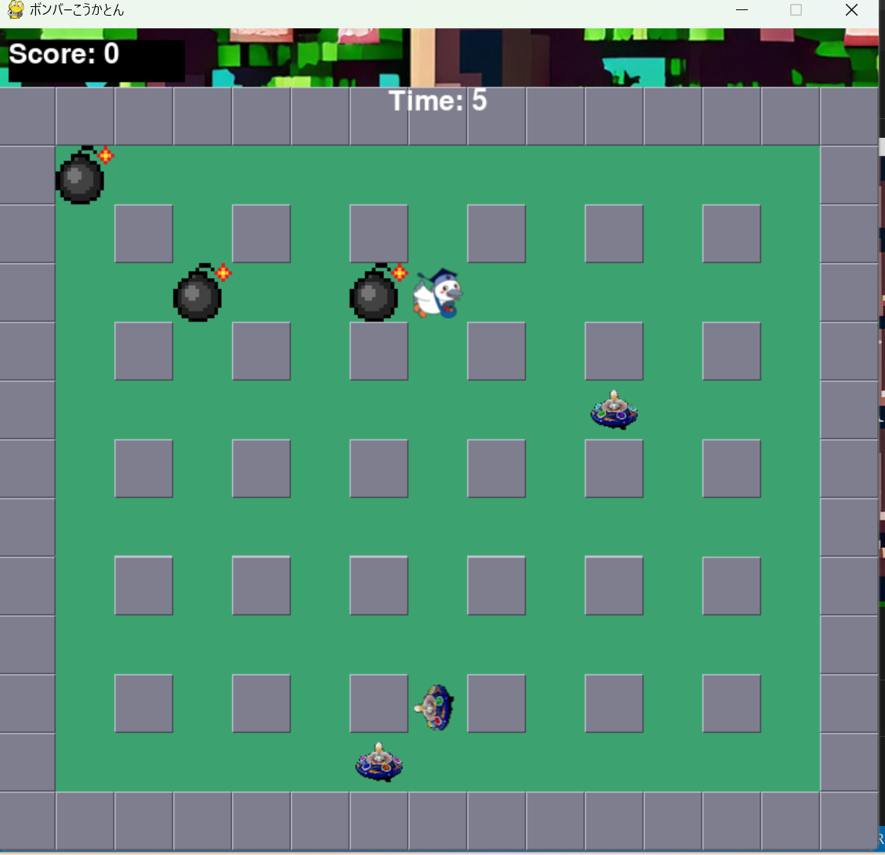

# ボンバーこうかとん

## 実行環境の必要条件
* python >= 3.10
* pygame >= 2.1

## ゲームの概要
* 障害物も敵も爆弾で破壊するゲーム with こうかとん
* 参考URL：[レトロゲームの殿堂](https://w.atwiki.jp/yamamura2/pages/374.html)

## ゲームの遊び方
* こうかとんを操作して爆弾を設置させよう。敵をすべて吹き飛ばせば勝利だ。
* 三分以内に他キャラクターを殲滅することで勝利。

* 移動操作：矢印キー押下で縦横方向へ移動。
* 爆弾設置：スペースキー押下でこうかとんの足元に爆弾を設置。上限は5つ、一種運の間があるので連投不可。自爆注意。
* 時間停止：スコア10を払うことで敵の動きを3秒間止める。時間は停止しないが爆弾をクールタイム無しで置き放題(設置上限は変わらず)

## ゲームの実装
### 共通基本機能
* 主人公キャラ
* 矢印操作機能
* 盤面領域内判定関数

### 分担追加機能
* Hero(操作キャラ)クラス(北村) : 操作するキャラクターに関するクラス
* 壁の生成、破壊機能クラス(北村) : エリア内の破壊できない障害物の当たり判定に関する関数
* マップ詳細生成機能クラス(北村) : マップのオブジェクトの生成に関するクラス
* 敵クラス(小林) : 敵を生成するクラス
* 爆弾の制御機能クラス(小林) : 爆弾の設置に関するクラス
* 他キャラの行動機能クラス(小林) : 他キャラクターの動きに関するクラス
* タイマー機能クラス (町田) : 制限時間に関するクラス
* 効果音、BGM制御機能クラス(町田) : 音に関するクラス
* スコア機能クラス(おん) : 敵を倒して時のスコアに関するクラス
* タイムストップ機能クラス(おん) : Shiftキーを押すと、敵が3秒間停止するクラス
* タイトル画面描画機能クラス(岡崎) : ゲームを始めた時のタイトル画面に関するクラス

* ゲームオーバー画面描画クラス(岡崎) : ゲームが終了したときの画面に関するクラス

### ToDo
- [1] マージ後のコメントなどの精査、修正
- [2] 記述方法の統一
- [3] 素材作成
- [4] 細かな機能の発案、実装
- [5] アイテム実装
- [6] 細かなバランス調整(敵との接触判定をつけた結果、難易度が上がったため、敵の爆弾設置をカット)

### メモ
* main関数は最低限の呼び出しのみで記述している
* 汎用的な関数を用意して、動作対象に適用している
* クラス、関数の順で記述する
